# ShipEast Couriers — Flow Diagrams

---

## 1. System Architecture Overview

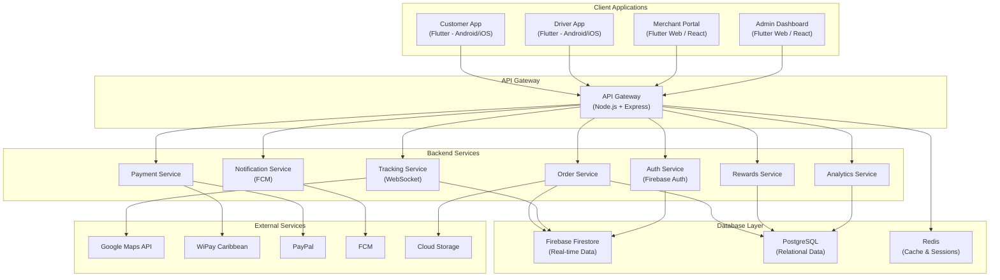

---

## 2. Customer Registration & Login Flow

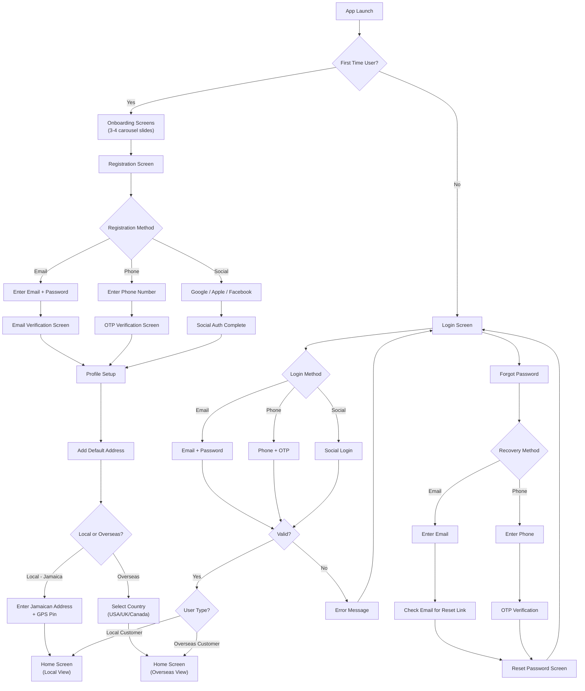

---

## 3. Food/Restaurant Order Flow

```mermaid
flowchart TD
    A["Home Screen"] --> B["Select 'Food Delivery'"]
    B --> C["Browse Restaurants<br/>(Filter: Cuisine, Rating, Distance)"]
    C --> D["Select Restaurant"]
    D --> E["View Menu<br/>(Categories, Items, Prices)"]
    E --> F["Add Items to Cart<br/>(Qty, Add-ons, Notes)"]
    F --> G{"Continue Shopping?"}
    G -->|Yes| E
    G -->|No| H["View Cart"]
    
    H --> I["Apply Promo Code<br/>(Optional)"]
    I --> J["Select Delivery Address"]
    J --> K["Select Delivery Time<br/>(ASAP / Schedule)"]
    K --> L["Select Payment Method<br/>(WiPay / PayPal / COD)"]
    
    L --> M["Order Summary<br/>(Items + Fees + Tax + Total)"]
    M --> N{"Confirm Order?"}
    N -->|No| H
    N -->|Yes| O["Order Placed"]
    
    O --> P["Push Notification<br/>'Order Confirmed'"]
    P --> Q["Merchant Receives Order"]
    
    Q --> R{"Merchant Decision"}
    R -->|Accept| S["Preparing Order"]
    R -->|Reject| T["Order Cancelled<br/>+ Refund Initiated"]
    
    S --> U["Order Ready"]
    U --> V["System Assigns Driver"]
    V --> W["Driver Accepts"]
    W --> X["Driver En Route to Pickup"]
    
    X --> Y["Driver Arrives at Restaurant"]
    Y --> Z["Driver Picks Up Order"]
    Z --> AA["Driver En Route to Customer<br/>(Live GPS Tracking)"]
    
    AA --> AB["Driver Arrives"]
    AB --> AC["Delivery Photo Taken"]
    AC --> AD["Order Delivered"]
    AD --> AE["Rate Driver & Restaurant<br/>(1-5 Stars + Review)"]
    AE --> AF["Reward Points Added"]
```

---

## 4. Grocery Order Flow

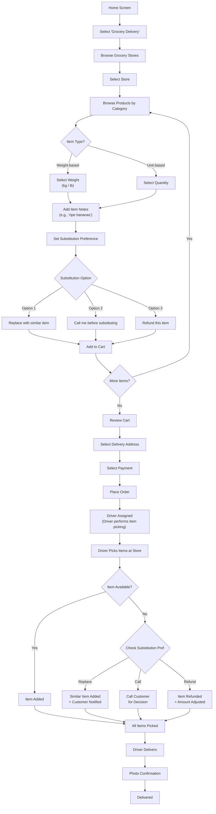

---

## 5. Errands/Custom Delivery Flow

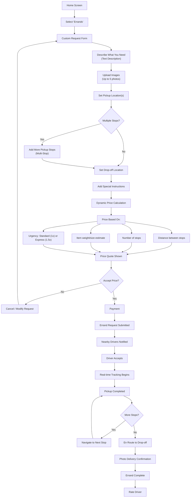

---

## 6. Overseas Ordering Flow

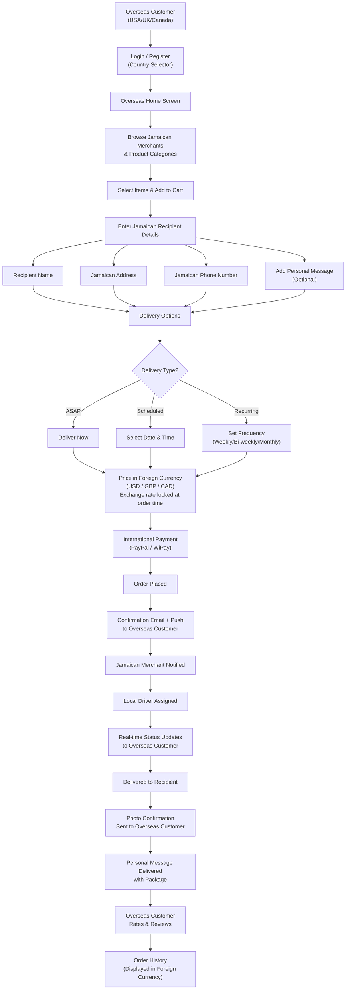

---

## 7. Service Marketplace Booking Flow

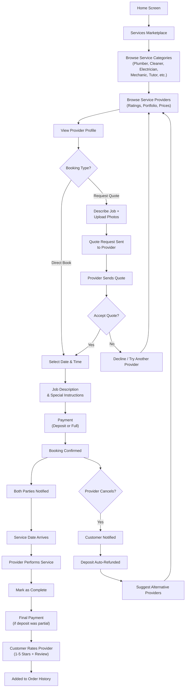

---

## 8. Driver App — Order Lifecycle Flow

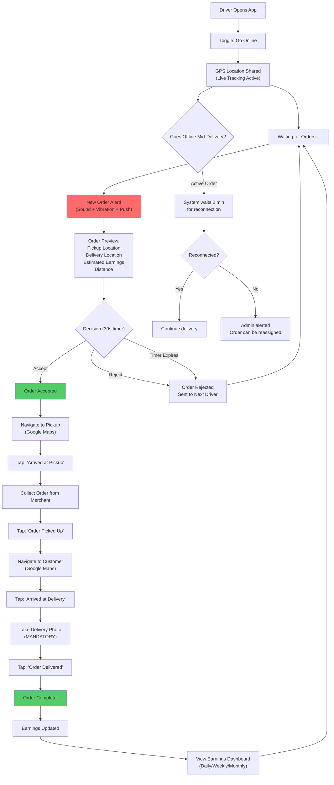

---

## 9. Driver Registration & Verification Flow

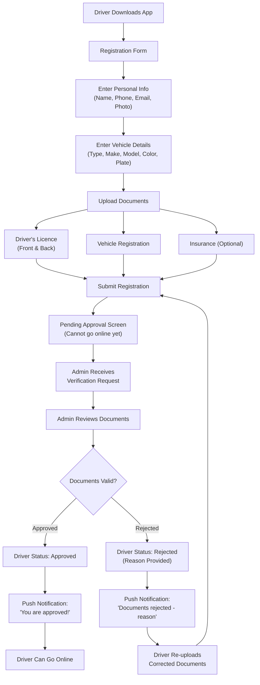

---

## 10. Merchant Registration & Approval Flow

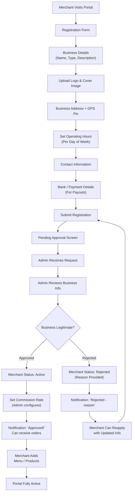

---

## 11. Merchant Order Management Flow

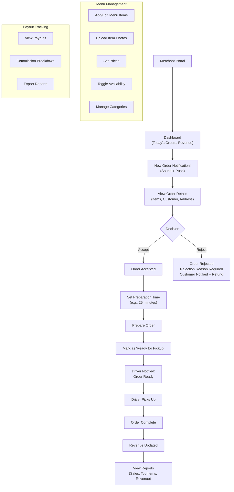

---

## 12. Admin Dashboard — Order Dispute Resolution Flow

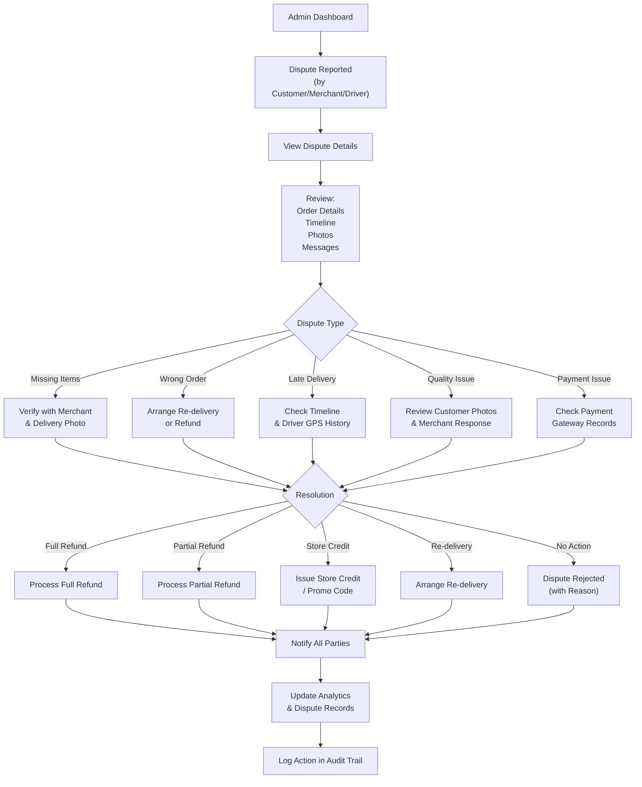

---

## 13. Payment Processing Flow

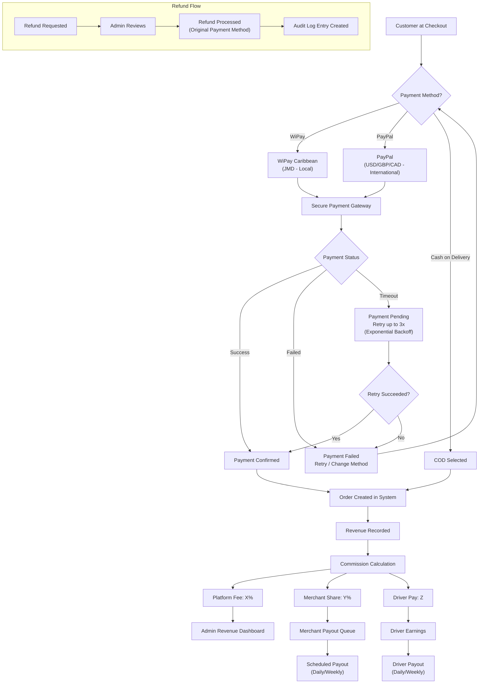

---

## 14. Push Notification Flow

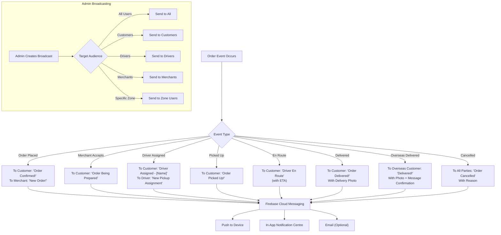

---

## 15. Rewards System Flow

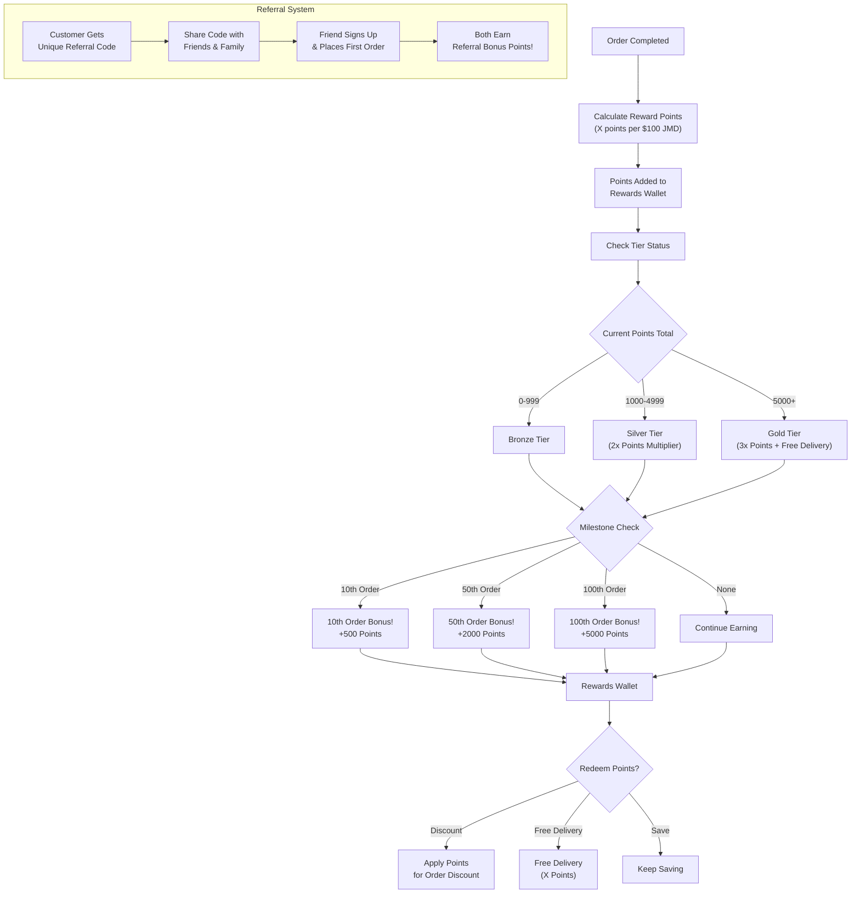

---

## 16. Complete Order State Machine

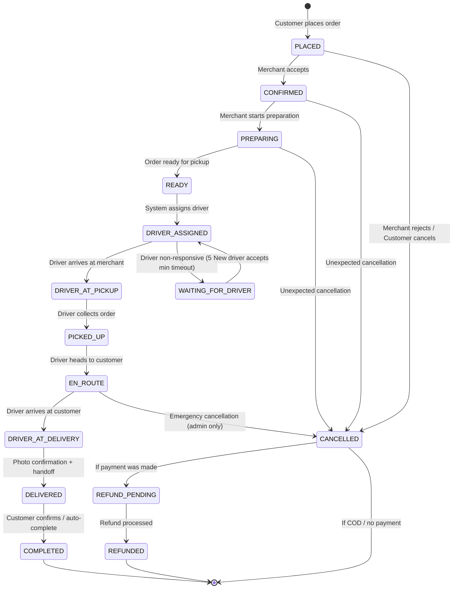

---

## 17. Scheduled & Recurring Order Flow

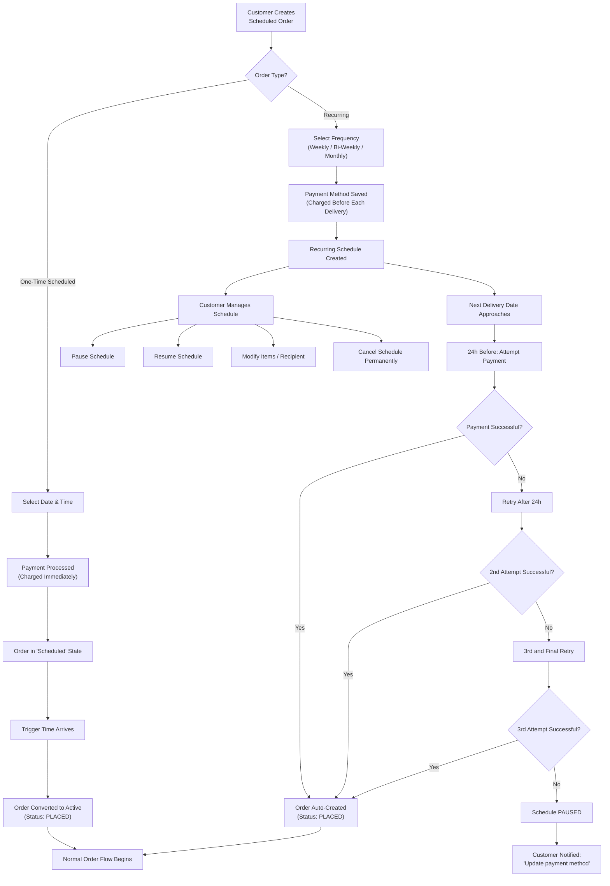

---

## 18. App Module Architecture

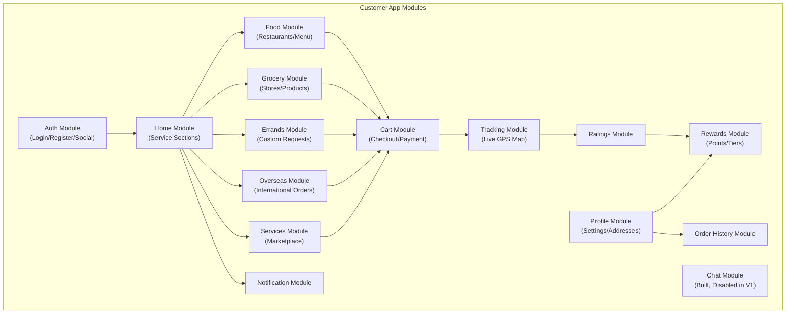

---

## 19. Driver Assignment Logic

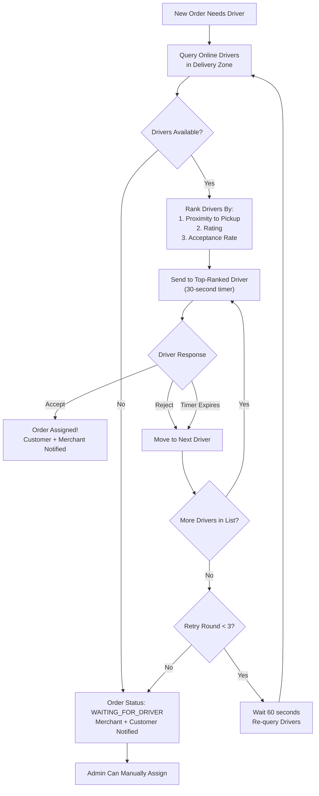
